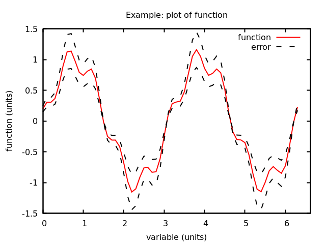
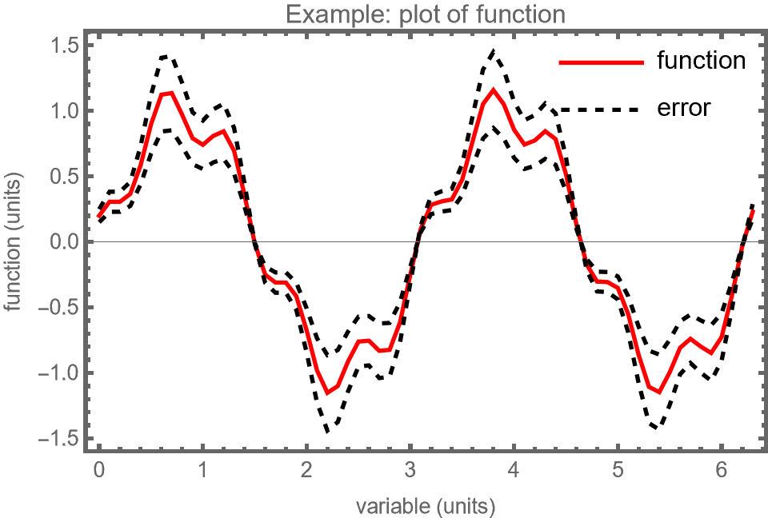
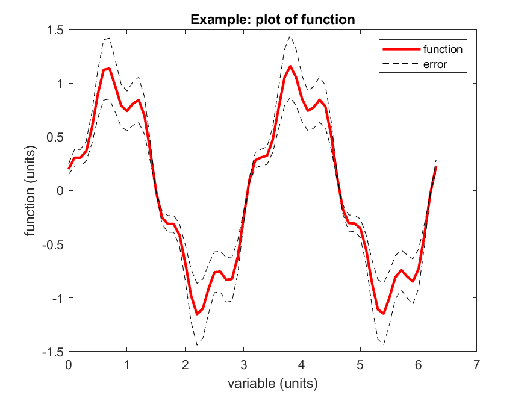

# Read text files - examples

Some basic examples for reading (and plotting) various types of text file.

* Examples in:
  * python ([readfile-py.py](./readfile-py.py), [readfile-py-extra.py](./readfile-py-extra.py))
    * python notebook: [readfile-ipynb-extra.ipynb](./readfile-ipynb-extra.ipynb) is a notebook version of `readfile-py-extra.py`
  * C++ ([readfile-cpp.cpp](./readfile-cpp.cpp), [readfile-cpp-extra.cpp](./readfile-cpp-extra.cpp))
  * gnuplot ([readfile-gpl.gnu](./readfile-gpl.gnu), [readfile-gpl-extra.gnu](./readfile-gpl-extra.gnu))
  * Mathematica ([readfile-mma.nb](./readfile-mma.nb))
    * You'll need Mathematica installed (+ Licence) to use this, don't worry if not
  * Matlab ([readfile_ml.m](./readfile_ml.m), [readfile_ml_extra.m](./readfile_ml_extra.m))  
    * ..because it's still 1997 somewhere
    * You'll need Matlab installed (+ Licence) to use this
  * C ([readfile-c.c](./readfile-c.c), [readfile-c-extra.c](./readfile-c-extra.c))
    * ..because it's still 1992 somewhere

* ["data.dat"](./data.dat) is a simple white-space delimetered text file, with no comments, and no header.
This is typically the simplest/easiest format to read in.

* ["data-csv-labels.dat"](./data-csv-labels.dat) is a comma separated file, with column headers, and a data header at the top that we need to skip/ignore, and comments

* The examples marked "extra" will read in the more complicated CSV data.

* Some really handy matplotlib (python plotting packing) "cheatsheets" are available: [matplotlib cheatsheets](https://matplotlib.org/cheatsheets/)

The resulting plots should look something like this:

| Python  | Gnuplot  |
|---|---|
|  |  |
| Mathematica  | Matlab  |
|  |  |

The C++ and C examples just reads in the data.
There isn't a built-in C++ function for plotting (there are libraries, but they are not commonly used).
Instead, you typically do any analysis inside the code, then output a text file for plotting.
