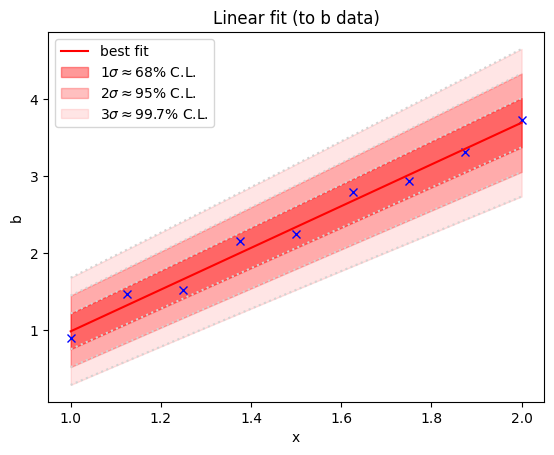
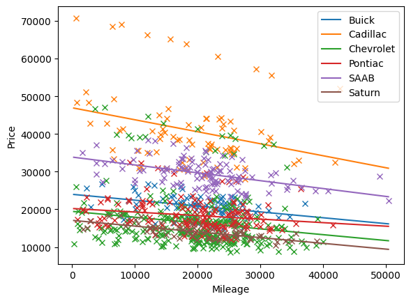
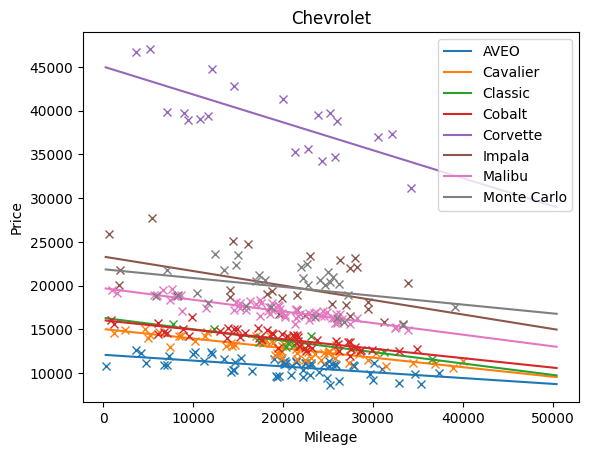
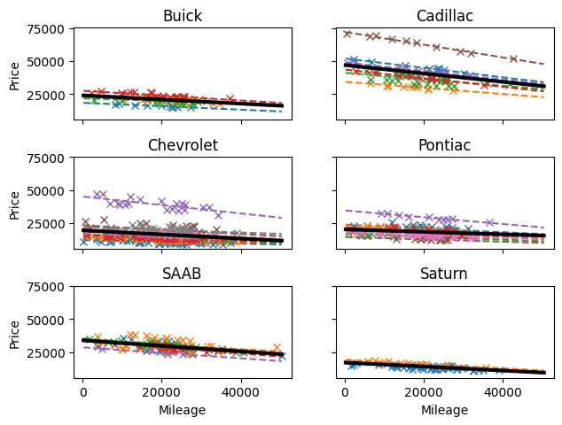

# Visualisation worksheet [6/3/2024]

## Week 3: Bivariate data

### 1. Curve fitting

Load the data in the file `xabc.csv`

* Plot the data in the variables a, b, and c vs x.
* Fit appropriate polynomials to these data, and plot your fitted curves.
* Plot suitable confidence intervals (you might want to use curve_fit).
  * You can assume the standard 68–95–99.7 rule, or use small-sample statistics

* Make your plots look pretty:
  * Ensure eveything is properly labelled
  * Ensure fonts are large enough to read easily if the figure was printed in a book/paper
  * Export the plots (e.g., to png format)

Feel free to make use of the examples provided in the lecture

### 2. Car prices

* Read in the data from 'CarsRetailPrice.csv'
* Note: There is a mix of text and numbers. If you're using python, you probably want to make use of `pandas` for this
  * See the `flu` example from last week if you're unsure!
* Invistigate the trends in the data
* Find the line of best fit to the price vs mileage.
* Notice that there are several other catagories. Can you say something more detailed by breaking the data up by catagory?

I'll provide (partial) solutions soon.

Before then, here's some examples of what the plots might look like.
My plots have several issues - your plots should do better!

| Makes: | Models: |
|--------|-------|
|  |    |

