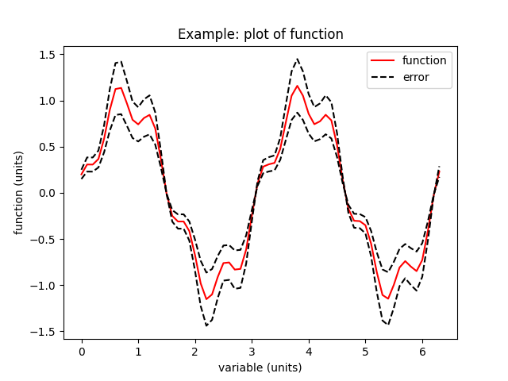
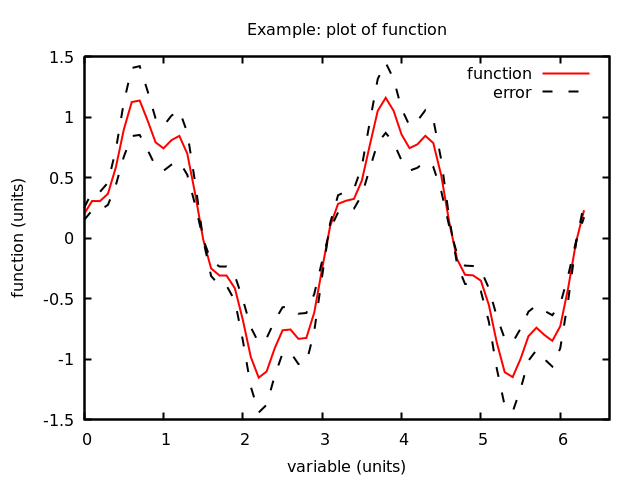
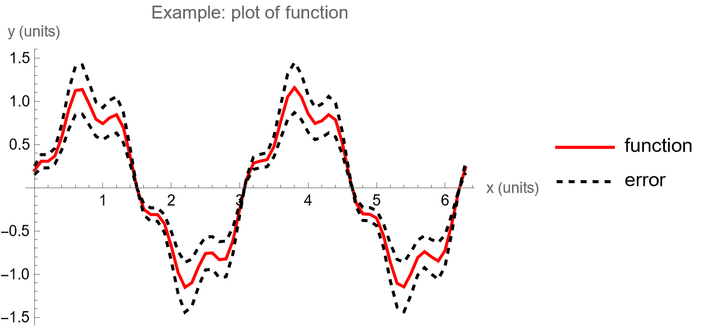
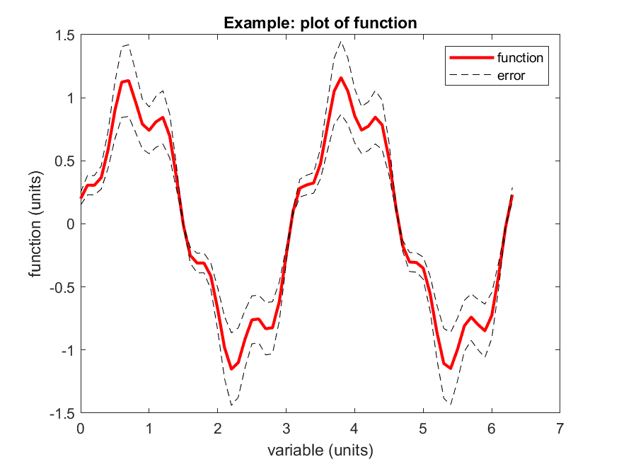
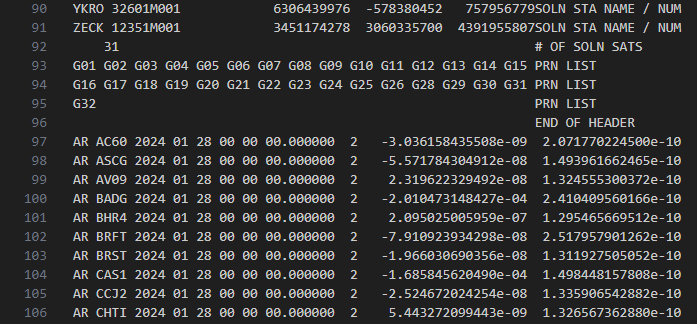
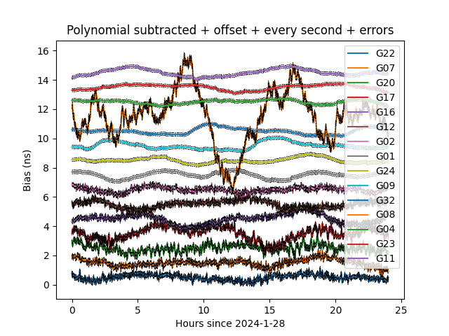

# Read text files - examples

Some basic examples for reading (and plotting) various types of text file.

* Examples in:
  * python ([python.py](./python.py), [python-extra.py](./python-extra.py))
  * C++ ([c++.cpp](./c++.cpp), [c++-extra.cpp](./c++-extra.cpp))
  * gnuplot ([gnuplot.gnu](./gnuplot.gnu), [gnuplot-extra.gnu](./gnuplot-extra.gnu))
  * Mathematica ([mathematica.nb](./mathematica.nb))
    * You'll need Mathematica installed (+Licence) to use this, don't worry if not
  * Matlab ([matlab.m](./matlab.m), [matlab_extra.m](./matlab_extra.m))  
    * ..because it's still 1997 somewhere
  * C ([c.c](./c.c), [c-extra.c](./c-extra.c))
    * ..because it's still 1992 somewhere

* ["data.dat"](./data.dat) is a simple white-space delimetered text file, with no comments, and no header.
This is typically the simplest/easiest format to read in.

* ["data-csv-labels.dat"](./data-csv-labels.dat) is a comma separated file, with column headers, and a data header at the top that we need to skip/ignore, and comments

* The python, C++, C, and gnuplot examples marked "extra" will read in the more complicated CSV data.

* Some really handy matplotlib (python plotting packing) "cheatsheets" are available: [matplotlib cheatsheets](https://matplotlib.org/cheatsheets/)

The resulting plots should look something like this:

| Python  | Gnuplot  | 
|---|---|
|  |  | 
| Mathematica  | Matlab  |
|  |  | 

The C++ and C examples just reads in the data.
There isn't a built-in C++ function for plotting (there are libraries, but they are not commonly used). 
Instead, you typically do any analysis inside the code, then output a text file for plotting.

----------------------------------

## Real-world example: GPS atomic clock data

The python file [gps-example.py](./gps-example.py) (also available as jupyter notebook: [gps-jupyter.ipynb](./gps-jupyter.ipynb)) downloads and plots data from the atomic clocks onboard the GPS satellites for a given day.

This file contains 316,798 lines of data - a snapshot looks like this:

...............................

...............................

- Type (either a satelite clock "AS" or a ground-based receiver clock "AR")
- Date stamp (YY MM DD HH MM SS)
- Number of data collumns (always 2)
- The clock reading "bias", in seconds
- The clock error

The data is not in the simplest format - each clock is listed for each time-stamp,
so, to plot the data for a given clock is not as simple as plotting one column vs. another.
The included python script shows how to deal with more complicated data files like this.

The resulting plot should look something like this:

