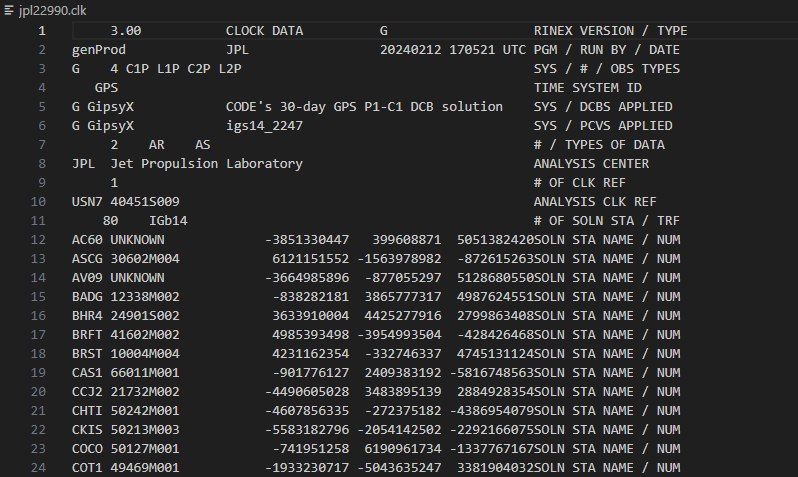
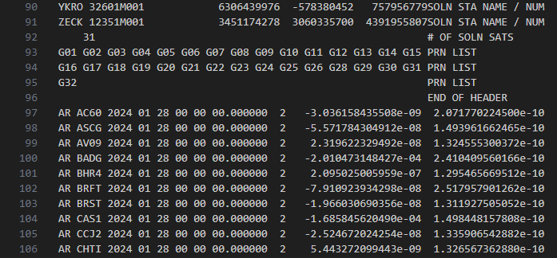

# Real-world example: GPS atomic clock data

The python file [gps-example.py](./gps-example.py) (also available as jupyter notebook: [gps-jupyter.ipynb](./gps-jupyter.ipynb)) downloads and plots data from the atomic clocks onboard the GPS satellites for a given day.

The data file contains 316,798 lines of data - a snapshot looks like this:

...............................

...............................

The data file has a large header section (which has important info, but we don't need).
The header continues until the 'END OF HEADER' string.
Then, the actual data actual data is in columns:

- Type (either a satelite clock "AS" or a ground-based receiver clock "AR")
- Name of the clock (e.g., "AC60" or "G01")
- Date stamp (6 rows: YYYY MM DD HH MM SS)
- Number of data collumns (always 2)
- The clock reading ("bias", in seconds)
- The clock error

The data is not in the simplest format - each clock is listed for each time-stamp.
So, to plot the data for a given clock is not as simple as plotting one column vs. another.
The included python script shows how to deal with more complicated data files like this.

The resulting plot should look something like this:

--------------------------

## Suggested exercise (basic)

- Calculate the standard deviation of each clock, plot as bar graph

## Suggested exercise (advanced)

- Calculate the Allan Deviation ([wikipedia.org/wiki/Allan_variance](https://en.wikipedia.org/wiki/Allan_variance)) for each clock, and plot a subset together
